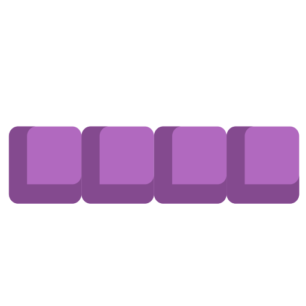
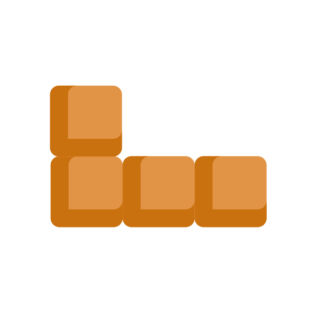
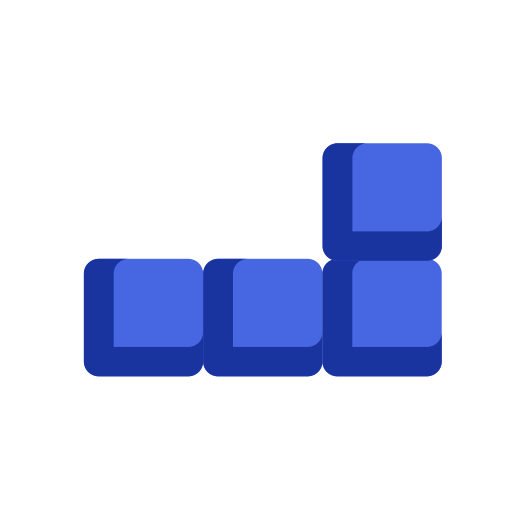
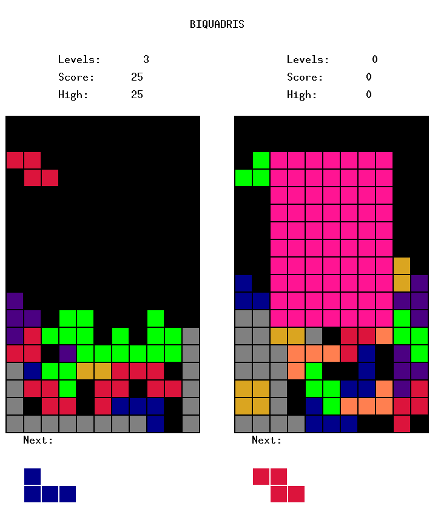

# {title}

*{publishedAt}* • *{readingTime} min read*
***

**\* Under [UWaterloo's Policy #73 (Intellectual Property)](https://uwaterloo.ca/secretariat/policies-procedures-guidelines/policies/policy-73-intellectual-property-rights), if you want to see the source code of this game, please contact me.**

## Introduction

The game of Biquadris is a Latinization of the well-known game [Tetris](https://en.wikipedia.org/wiki/Tetris), consisting of two players competition and seven different types of blocks (with one additional star block). A player obtain scores for filling all the cells of one line, as well as deleting all the cells of one block, where different levels significantly impact the amount of score. One player’s game is over when a new block cannot be properly fitted on the game board. During a player’s turn, the block that the opponent will have to play next is already at the top of the opponent’s board and if it does not fit, the opponent has lost. Player can choose to start a new game or quit when a game is over.

### Blocks

There are seven types of blocks.

***
| I-Block | J-Block | L-Block | O-Block | S-Block | T-Block | Z-Block |
| :-----: | :-----: | :-----: | :-----: | :-----: | :-----: | :-----: |
|  |  |  |  |  |  |  |
***

### Board

The board consists of `11` columns and `15` rows. There are three extra rows (total `18`) at the top of the board to give room for blocks to rotate.

## Features

Following can act as a guide to the game of Biquadris, but are also crucial components of implementing the game.

### Command-line Interface

* `-keyboard` runs the program in the keyboard listener mode.
* `-text` runs the program in text-only mode. No graphics are displayed. The default behaviour (no `-text`) is to show both text and graphics.
* `-seed xxx` sets the random number generator’s seed to `xxx`.
* `-scriptfile1 xxx` Uses `xxx` as a source of blocks for level 0, for player 1.
* `-scriptfile2 xxx` Uses `xxx` as a source of blocks for level 0, for player 2.
* `-startlevel n` Starts the game in level n. The game starts in level 0 if this option is not supplied.

### Command Interpreter

* `left` moves the current block one cell to the left. If this is not possible (left edge of the board, or block in the way), the command has no effect.
* `right` as above, but to the right
* `down` as above, but one cell downward.
* `clockwise` rotates the block 90 degrees clockwise, as described earlier. If the rotation cannot be accomplished without coming into contact with existing blocks, the command has no effect.
* `counterclockwise` as above, but counterclockwise.
* `drop` drops the current block. It is (in one step) moved downward as far as possible until it comes into contact with either the bottom of the board or a block. This command also triggers the next block to appear. Even if a block is already as far down as it can go (as a result of executing the down command), it still needs to be dropped in order to get the next block.
* `levelup` increases the difficulty level of the game by one. The block showing as next still comes next, but subsequent blocks are generated using the new level. If there is no higher level, this command has no effect.
* `leveldown` decreases the difficulty level of the game by one. The block showing as next still comes next, but subsequent blocks are generated using the new level. If there is no lower level, this command has no effect.
* `norandom file` Relevant only during levels 3 and 4, this command makes these levels non-random, instead taking input from the sequence `file`, starting from the beginning. This is to facilitate testing.
* `random` Relevant only during levels 3 and 4, this command restores randomness in these levels.
* `sequence file` executes the sequence of commands found in `file`. This is to facilitate the construction of test cases.
* `I`, `J`, `L`, etc. Useful during testing, these commands replace the current undropped block with the stated block. Heaviness is detemined by the level number. Note that, for heavy blocks, these commands do not cause a downward move.
* `restart` clears the board and starts a new game.

### Keyboard Listener

***
| Key | Action |
|:---:|:------:|
| $\leftarrow$ | move left|
| $\rightarrow$ | move right|
| $\downarrow$ | move down|
| $\uparrow$ | rotate clockwise|
| c |  rotate counterclockwise|
| [space] |  drop|
| = |  level up|
| - |  level down|
| i |  mutate to I block|
| j |  mutate to J block|
| l |  mutate to L block|
| o |  mutate to O block|
| s |  mutate to S block|
| t |  mutate to T block|
| z |  mutate to Z block|
| r |  restart the game|
| 0 |  enable/disable multiple special actions|
***

### Scoring

The game is scored as follows: when a line (or multiple lines) is cleared, you score points equal to (your current level, plus number of lines) squared. (For example, clearing a line in level 2 is worth 9 points.) In addition, when a block is completely removed from the screen (i.e., when all of its cells have disappeared) you score points equal to the level you were in when the block was generated, plus one, squared. (For example if you got an O-block while on level 0, and cleared the O-block in level 3, you get 1 point.)

You are to track the `current` score and the `hi` score. When the `current` score exceeds the `hi` score, the `hi` score is updated so that it matches the `current` score. When the game is restarted, the `current` score reverts to 0, but the `hi` score persists until the program terminates.

### Levels

There are 5 levels. The level of difficulty of the game depends on the policy for selecting the next block

* Level 0:
    * Takes its blocks in sequence from the files `xxx1.txt` (for player 1) and `xxx2.txt` (for player 2), whose names are supplied on the command line.
    * If you get to the end of one of these files, and the game hasn’t ended yet, begin reading the file again from the beginning.
* Level 1:
    * The block selector will randomly choose a block with probabilities skewed such that S and Z blocks are $\frac{1}{12}$ each, and the other blocks are selected with probability $\frac{1}{6}$ each.
* Level 2:
    * All blocks are selected with the equal probabilty
* Level 3:
    * The block selector will randomly choose a block with probabilities skewed such that S and Z-blocks are selected with probability $\frac{2}{9}$ each, and the other blocks are selected with probability $\frac{1}{9}$ each
    * Blocks generated in level 3 are ***heavy***: every command to move or rotate the block will be followed immediately and automatically by a downward move of one row (if possible).
* Level 4:
    * In addition to the rules of Level 3, in Level 4 there is an external constructive force: every time you place 5 (and also 10, 15, etc.) blocks without clearing at least one row, a `1x1` block (indicated by * in text, and by the colour brown in graphics) is dropped onto your game board in the centre column. Once dropped, it acts like any other block: if it completes a row, the row disappears. So if you do not act quickly, these blocks will work to eventually split your screen in two, making the game difficult to play.

### Special Actions

If a player, upon dropping a block, clears two or more rows simultaneously, a special action is triggered. A special action is a negative influence on the opponent's game. When a special action is triggered, the game will prompt the player for his/her chosen action. Available actions are as follows:

* `blind` The player’s board, from columns 3-9, and from rows 3-12, is covered with question marks (?), until the player drops a block; then the display reverts to normal.
* `heavy` Every time a player moves a block left or right, the block automatically falls by two rows, after the horizontal move. If it is not possible for the block to drop two rows, it is considered to be dropped, and the turn ends.
* `force` Change the opponent’s current block to be one of the player’s choosing. If the block cannot be placed in its initial position, the opponent loses. (E.g., force Z)
* `moveUp` Assign the player 5 opportunities to move the current block up thereafter. This helps players to revert back to some previous position if they mistakenly made certain actions.

## Object Oriented Programming

Following are the object oriented components employed in this project.

### [Model View Controller](https://en.wikipedia.org/wiki/Model%E2%80%93view%E2%80%93controller)

The class `Player` is an abstraction of all the **models** include the `Board`, the `Level`, the `Cell`, and the `Score`. It *notifies* the **View** to update the game display. The class `DisplayObserver` is an abstract *observer* class. It is inherited by `TextDisplay` and `GraphicsDisplay` to show the UI of the game. The **Controller** class is in charge of starting/restarting the game, controlling the game states, and communicating between the **Model** and the **View**. Apart from a default command-line controller, we also implemented a keyboard controller.

### [Strategy Pattern](https://en.wikipedia.org/wiki/Strategy_pattern)

The different levels can be treated as a family of algorithms to generate the next blocks. The strategy pattern encapsulates each one of them, and makes them interchangeable at run time.

### [Observer Pattern](https://en.wikipedia.org/wiki/Observer_pattern)

There are basically two `(subject, observer)` pairs in this program. The first is the aforementioned *MVC* design pattern, where the **view** is the observer of the **models**. The other one is that each `cell` in the `board` is an observer to the `block`, because as the `block`'s state changes, the `cell` update its states accordingly.

### [Polymorphism](https://en.wikipedia.org/wiki/Polymorphism_(computer_science))

Both the `AbstracBlock` along with concrete blocks and the `AbstractLevel` along with concrete levels utilize the inheritance relationship, and thus making it easy to add additional features and minimizing the re-compliance.

### [Single Responsibility Principle](https://en.wikipedia.org/wiki/Single-responsibility_principle)

The overall design of our program follows the *Single Responsibility Principle*, where each of the class serves its own set of functionality. For example, the `Score` class can be easily incorporated into the `Player` class, but we encapsulate it to be a separated class because we probably want to add more scoring rules to the game.
